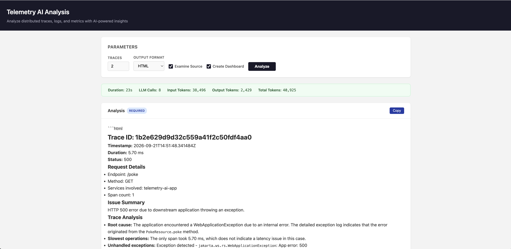
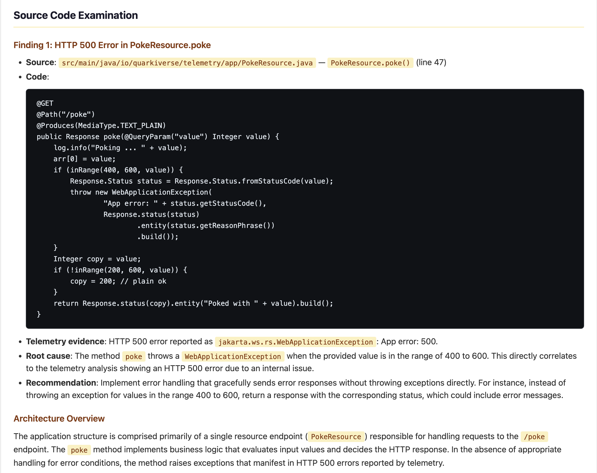
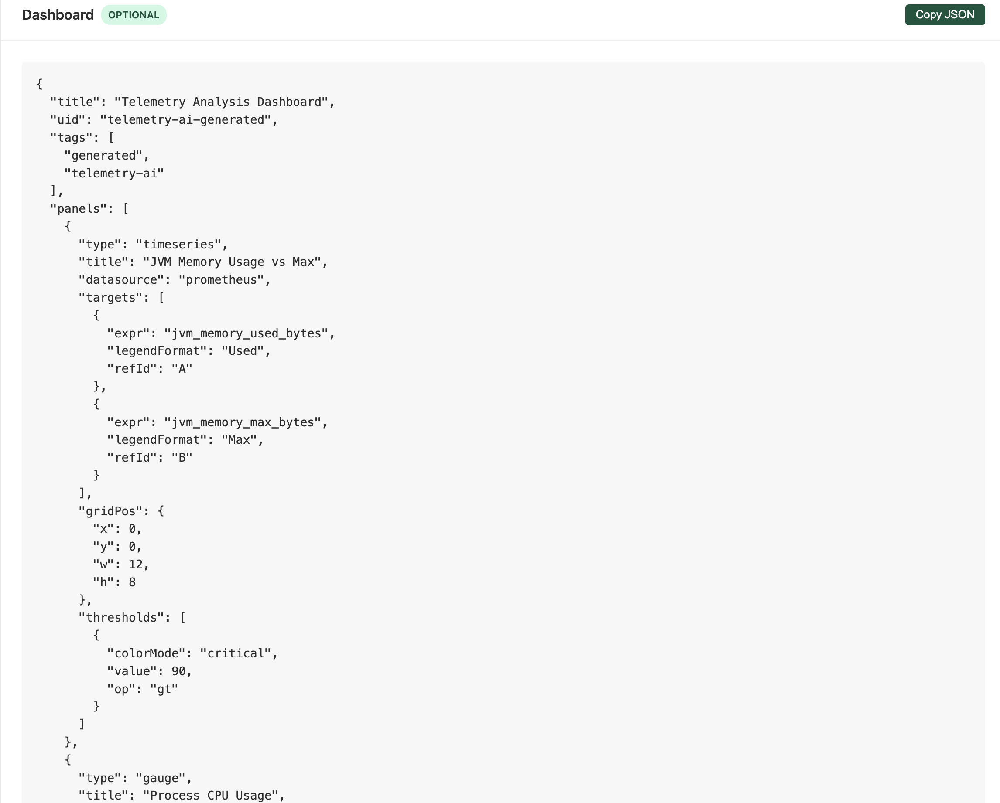

<!-- _class: title -->

# Telemetry AI

LLM-powered root-cause analysis of distributed telemetry

**Quarkus + LangChain4j + Grafana LGTM + MCP**

---

# Architecture

<pre class="mermaid">
flowchart LR
User[User]
AI[AI Module]
subgraph Apps[Quarkus Microservices]
App1[App 1]
App2[App 2]
App3[App 3]
end
subgraph Ext[Ext Module]
ExtApp[Ext App]
Toxi[Toxiproxy]
MySQL[MySQL]
OpenMeteo[Open-Meteo API]
end
subgraph LGTM[LGTM Stack]
Tempo[Tempo]
Loki[Loki]
Prom[Prometheus]
end
subgraph LLMs[LLM Providers]
OpenAI[OpenAI]
Grok[Grok]
Gemini[Gemini]
WatsonX[WatsonX]
end
User --> AI
User --> App1
App1 -->|REST| App2
App2 -->|REST| App3
ExtApp -->|JDBC| Toxi
ExtApp -->|REST| Toxi
Toxi --> MySQL
Toxi --> OpenMeteo
Apps -.->|OTel| LGTM
Ext -.->|OTel| LGTM
Tempo <-->|MCP| AI
Loki <-->|MCP| AI
Prom <-->|MCP| AI
AI <-->|Dev MCP| Apps
AI <-->|Dev MCP| Ext
AI -->|LangChain4j| LLMs
style AI fill:#3498db,color:#fff
style Apps fill:#f5f5f5,stroke:#2ecc71
style Ext fill:#f5f5f5,stroke:#e67e22
style LGTM fill:#f5f5f5,stroke:#bbb
style LLMs fill:#f5f5f5,stroke:#bbb
</pre>

Monitored apps expose **Dev MCP** for source examination and dashboard creation.
**Ext module** routes JDBC and Weather API calls through **Toxiproxy** for chaos injection.

---

# Analysis Pipeline

<pre class="mermaid">
sequenceDiagram
participant U as User
participant AI as AI Module
participant LGTM as LGTM
participant LLM as LLM
U->>AI: GET /analyze/n
AI->>LLM: System prompt + tools
loop Traces
LLM->>LGTM: Get trace + logs
LGTM-->>AI: Raw data
AI-->>LLM: Stripped data (via StripMcpClient)
end
LLM->>LGTM: Get metrics
LGTM-->>AI: Raw metrics
AI-->>LLM: Filtered metrics
LLM-->>AI: Analysis report
AI-->>U: HTML / Markdown / Text
</pre>

`StripMcpClient` filters MCP tool results — drops SDK metadata, histogram buckets, Netty/OTel internals, static counters, per-region breakdowns.

---

# Post-Analysis Pipeline

<pre class="mermaid">
sequenceDiagram
participant AI as AI Module
participant LLM as LLM
participant Apps as App Dev MCP
AI->>LLM: examineSource(analysis)
loop Each workspace
LLM->>Apps: getWorkspaceItems
Apps-->>LLM: Source file list
LLM->>Apps: getWorkspaceItemContent
Apps-->>LLM: Source code
end
LLM-->>AI: Source examination report
AI->>LLM: createDashboard(analysis)
LLM-->>Apps: saveWorkspaceItemContent (dashboard JSON)
LLM-->>AI: Dashboard JSON
Note over AI: sanitizeDashboardJson +<br/>fallback save to unsaved workspaces
</pre>

Both steps use **Dev MCP** tools — the LLM reads app source and writes Grafana dashboards directly into each workspace via `saveWorkspaceItemContent`.

---

# Screenshots — Analysis UI



Web UI: parameters panel, duration/LLM stats, and analysis output with trace details.

---

# Screenshots — Source Examination



Source examination: code snippets, telemetry evidence, root cause analysis.

---

# Screenshots — Dashboard Generation



Generated Grafana dashboard JSON with JVM Memory, CPU Usage, and application metrics panels.

---

# LLM Provider Support

| Provider | Model | Status | Notes |
|----------|-------|--------|-------|
| **OpenAI** | gpt-4o-mini | ✅ Fully tested | Default provider |
| **Grok/xAI** | grok-3-mini | ✅ Fully tested | OpenAI-compatible API |
| **Gemini** | gemini-pro | ⚙️ Configured | Not yet integration-tested |
| **WatsonX** | Granite | ⚙️ Configured | JSON validator guardrail |
| **Anthropic** | — | 🔧 Planned | API key config exists |

Profile-based selection via Maven + Quarkus profiles:
```bash
./mvn.ai.sh quarkus:dev           # OpenAI (default)
./mvn.ai.sh quarkus:dev -Pgrok    # Grok/xAI
./mvn.ai.sh quarkus:dev -Pgemini  # Gemini
```

---

# Chaos Engineering

**11 chaos types** for realistic failure simulation in the monitored app:

| Type | What It Does |
|------|-------------|
| `delay` | Thread.sleep (configurable ms) |
| `memory` | Allocate N MB (released after request) |
| `cpu` | CPU burn loop for N ms |
| `leak` | Allocate N MB (never freed) |
| `error` | Random 5xx WebApplicationException |
| `exception` | Unhandled RuntimeException (HTTP 500) |
| `threadpool` | Block 10 threads via CountDownLatch |
| `contention` | 10 threads competing for single synchronized lock |
| `gc` | Rapid alloc/dealloc loop → GC pressure |
| `intermittent` | Random failures at configurable rate (mixed 5xx/200) |
| `deadlock` | Two threads deadlocked on competing locks (timeout) |

All invoked via: `GET /chaos?type={type}&intensity={value}`

---

# Database Chaos Testing

**DB module** with JPA/Panache entities, routed through **Toxiproxy** for infrastructure-level chaos:

```
Test JVM → Toxiproxy (localhost:33061) → MySQL (localhost:33060)
                ↕ REST API (:8474)
         addLatency / cutConnection
```

| Toxic | Effect | Test Scenario |
|-------|--------|---------------|
| `latency` (3s downstream) | Slow query responses | Slow Queries |
| `latency` (4s) + small pool | Connection pool exhaustion | Pool Exhaustion |
| `bandwidth` (0 rate) | Connection cut | DB Outage |

- **JDBC telemetry** (`quarkus.datasource.jdbc.telemetry=true`) creates separate DB query spans
- AI sees `GET /poke (3019ms) → SELECT ... (3015ms)` and identifies **database-level** root cause
- No application code changes needed — chaos is injected at the network layer via Toxiproxy REST API

---

# Weather Chaos Testing

**Weather module** with REST client calling **Open-Meteo API**, routed through **Toxiproxy** for external-dependency chaos:

```
Test JVM → Ext App → Toxiproxy (localhost:8888) → Open-Meteo API (api.open-meteo.com)
                          ↕ REST API (:8474)
                   addLatency / cutConnection
```

| Toxic | Effect | Test Scenario |
|-------|--------|---------------|
| `latency` (3s downstream) | Slow weather API responses | Slow API |
| `bandwidth` (0 rate) | Connection cut to weather API | API Outage |
| _(none)_ | Normal operation | Normal Weather |

- **REST client auto-instrumented** by `quarkus-opentelemetry` — no extra config needed
- AI sees `GET /weather (3012ms) → GET /v1/forecast (3008ms)` and identifies **external API** latency
- Outage test verifies both failure detection and recovery after connection restore

---

# Integration Tests — Chaos (1-12)

**19 end-to-end scenarios** with LLM-as-judge scoring (threshold: 70/100):

| # | Scenario | What It Tests |
|---|----------|--------------|
| 1 | Normal Traffic | Healthy requests → no false positives |
| 2 | Error Traffic | HTTP 4xx/5xx → error pattern detection |
| 3 | Latency | Thread.sleep delays → latency spike detection |
| 4 | Resource Pressure | Memory + CPU + leaks → resource concern detection |
| 5 | Cascading Failure | Exception + threadpool + GC → multi-chaos correlation |
| 6 | Lock Contention | Synchronized lock contention → thread blocking |
| 7 | Intermittent Failures | ~60% random failure rate → flaky error detection |
| 8 | Network Partition | App stopped/restarted → outage detection |
| 9 | Request Flood | Multiple delayed requests + error → latency detection |
| 10 | Deadlock | Thread deadlock → deadlock detection |
| 11 | Source Examination | Dev MCP source analysis → code correlation |
| 12 | Dashboard Generation | Grafana dashboard JSON → visualization quality |

---

# Integration Tests — DB & Weather (13-19)

| # | Module | Scenario | What It Tests |
|---|--------|----------|--------------|
| 13 | DB | Normal Traffic | Database queries → healthy state confirmation |
| 14 | DB | Slow Queries | Toxiproxy 3s latency → DB slowness detection |
| 15 | DB | Pool Exhaustion | 4s latency + small pool → mixed failures |
| 16 | DB | DB Outage | Toxiproxy connection cut → outage detection |
| 17 | Weather | Normal Weather | Weather API queries → healthy operation |
| 18 | Weather | Slow API | Toxiproxy 3s latency → external API slowness |
| 19 | Weather | API Outage | Toxiproxy cut → external service unavailability |

Full stack: **App/DB/Weather → Telemetry → AI Analysis → LLM Scorer**

---

# Test Results — Cross-Provider Matrix

All 19 scenarios pass across tested provider combinations:

| AI Provider | Scorer | Chaos 1-6 | Chaos 7-10 | Chaos 11-12 | DB 13-16 | Weather 17-19 |
|-------------|--------|-----------|------------|-------------|----------|---------------|
| OpenAI | OpenAI | ✅ **6/6** | — | — | — | — |
| Grok | OpenAI | ✅ **6/6** | ✅ **4/4** | ✅ **2/2** | ✅ **4/4** | ✅ **3/3** |
| OpenAI | Grok | ✅ **6/6** | ✅ **4/4** | ✅ **2/2** | ✅ **4/4** | ✅ **3/3** |
| Grok | Grok | ✅ **6/6** | — | — | — | — |

```bash
./run-integration-test.sh chaos openai grok     # AI=openai, scorer=grok
./run-integration-test.sh db openai grok        # DB tests
./run-integration-test.sh weather openai grok   # Weather tests
./run-integration-methods.sh db openai grok analyzeSlowQueries
```

---

# Milestones

| Milestone | Status | Key Deliverables |
|-----------|--------|-----------------|
| **M1** Core Analysis | ✅ Done | MCP integration, prompt engineering, Web UI |
| **M2** Multi-Provider | ✅ Done | OpenAI, Grok, Gemini, WatsonX profiles |
| **M3** Chaos & Eval | ✅ Done | 11 chaos types, 19 test scenarios, LLM-as-judge |
| **M4** Advanced | ✅ Done | Source exam, dashboard gen, DB + Weather chaos via Toxiproxy |
| **M5** Production | 🔄 In Progress | Provider matrix ✅, Anthropic, native image, perf |

---

# Blockers & Next Steps

### Blockers
- **Metrics timing gap** — Prometheus snapshots miss transient chaos pressure; prompt trusts logs over metrics
- **Gemini/WatsonX untested** — blocked on API key provisioning

### Help Needed
- API keys for Gemini / WatsonX integration testing
- Grafana MCP server stability (embedded vs external)
- Initial testers trying out AI module / app and evaluating results or/and usefulness

### Next Steps
- Anthropic provider integration
- Native image compilation

---

# Release Roadmap

### 🏠 Project Home
- Establish as a **top-level Quarkiverse project** (e.g. `quarkiverse/quarkus-telemetry-ai`)
- Dedicated GitHub org with CI/CD, issue tracking, and release automation
- Align with Quarkiverse governance: extension registry, compatibility matrix

### 📦 Distribution
- Publish **AI module as an uberjar** to Maven Central
  - Self-contained artifact: AI engine + MCP clients + Web UI
  - Single dependency for downstream consumers
- Versioned releases with changelogs and migration guides

### 📖 Documentation
- **Build pipeline**: Antora or MkDocs site generated from `docs/` sources
- **Hosting**: GitHub Pages or Quarkiverse docs portal
- **Content**: Getting started guide, configuration reference, chaos type catalog, API docs
- **Slides**: Auto-build `slides.html` from `SLIDES.md` via Marp in CI
- **Update workflow**: PRs that touch `docs/` trigger preview builds

---

<script type="module">
import mermaid from 'https://cdn.jsdelivr.net/npm/mermaid@11/dist/mermaid.esm.min.mjs';
mermaid.initialize({ startOnLoad: true, theme: 'default' });
</script>

